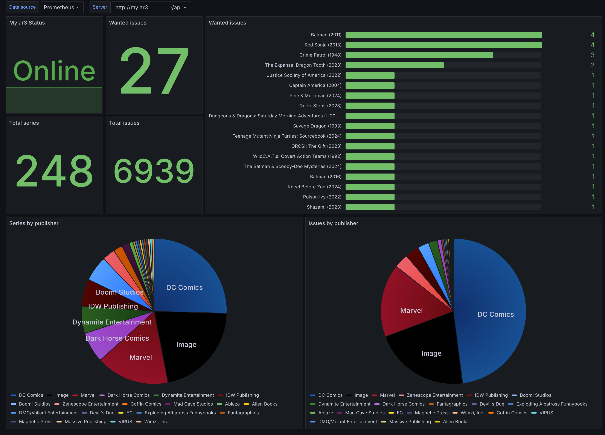

# prometheus-mylar3-exporter

<p align="center">

</p>

A [Mylar3](https://github.com/mylar3/mylar3) prometheus exporter written in Go.

## Pre-requisites

This tool requires Mylar3 API to be enabled and an API key to access it. You can do it under `Settings` -> `Web interface` and set `Enable API` option. Then generate an API key to be used for the exporter.

## How to use it

You can download the latest available binary from the Releases and run it locally

```bash
./mylar3-exporter \
    --mylar3.api-uri="http://mylar3.local/api" \
    --mylar3.api-key="your-key-goes-here"
```

Another option is run it in a docker container.

```bash
docker run \
    -e MYLAR3_API_URI=http://mylar3.local \
    -e MYLAR3_API_KEY=your-key-goes-here \
    -p 9091:9091 \
    ghcr.io/esanchezm/prometheus-mylar3-exporter:latest
```

Add this to your prometheus.yml
```yaml
  - job_name: "mylar3_exporter"
    static_configs:
        - targets: ['mylar3-exporter:9091']
```

### Docker compose

```yaml
  mylar3-exporter:
    image: ghcr.io/esanchezm/prometheus-mylar3-exporter:latest
    environment:
      - "MYLAR3_API_URI=http://mylar3.local/api"
      - "MYLAR3_API_KEY=your-key-goes-here"
    ports:
      - "9091:9091"
```

## Parameters

The exporter can read configuration using environment variables or parameters:
| Argument                   | Environment variable      | Default      | Description                                                                |
|----------------------------|---------------------------|--------------|----------------------------------------------------------------------------|
| `--mylar3.api-uri`         | `MYLAR3_API_URI  `        |              | Mylar3 API URL. It's normally the Mylar3 URL ending in `/api`              |
| `--mylar3.api-key`         | `MYLAR3_API_KEY`          |              | Mylar3 API key. See Pre-requisites for instructions on how to generate     |
| `--mylar3.timeout`         | `MYLAR3_TIMEOUT`          | `10`         | Timeout in seconds to connect to the Mylar3 server                         |
| `--[no-]mylar3.verify-ssl` | `MYLAR3_VERIFY_SSL`       | `"True"`     | Whether to verify the SSL certificate when connecting to the Mylar3 server |
| `--web.listen-address`     | `EXPORTER_LISTEN_ADDRESS` | `":9091"`    | Address where the exporter will listen for connections                     |
| `--web.telemetry-path`     | `EXPORTER_LISTEN_PATH`    | `"/metrics"` | Metrics expose path                                                        |
| `--log.level`              | `EXPORTER_LOG_LEVEL`      | `info`       | Log level. One of: `debug`, `info`, `warn`, `error`, `fatal`               |

## Metrics

These are the metrics this program exports:

| Metric name           | Type  | Description                                                                                                             |
|-----------------------|-------|-------------------------------------------------------------------------------------------------------------------------|
| `mylar3_up`           | gauge | Whether the Mylar3 server is answering requests from this exporter. A `version` label with the server version is added. |
| `mylar3_series_count` | gauge | Total number of series, grouped by `publisher` as a metric label.                                                       |
| `mylar3_issues_count` | gauge | Total number of issues, grouped by series `publisher`, `name`, `year`, and `status`.                                    |
| `mylar3_wanted_count` | gauge | Total number of issues in wanted state, with labels for `publisher`, `name` and `year`                  |

## Screenshot



[More info](./grafana/README.md)


## License

This software is released under the [Apache](LICENSE).
